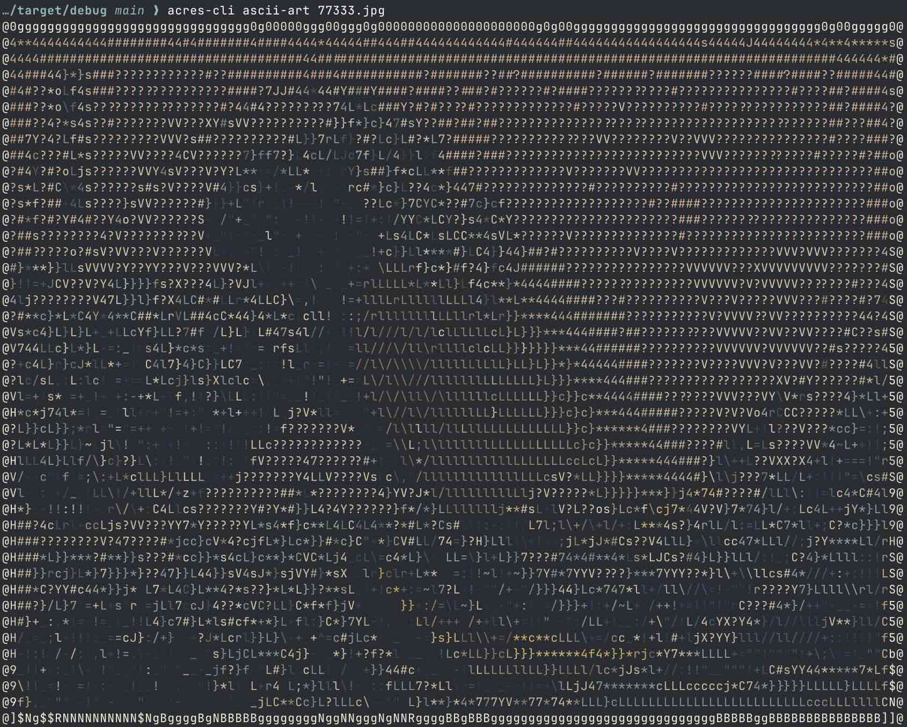

# acres

This is a collection of tools for working with [The Art Institute of Chicago API](https://api.artic.edu/docs/#introduction) in [Rust](https://rust-lang.org/):

- [`acres`](./acres/): A library for easy, ergonomic programming against the Art Institute API
- [`iiif`](./iiif/): A library for working with servers implementing supporting [International Image Interoperability API 2.0](https://iiif.io/api/image/2.0/).
- [`image-to-ascii-builder`](./image-to-ascii-builder/): A library that implements the [builder pattern](https://rust-unofficial.github.io/patterns/patterns/creational/builder.html) for the awesome [`image-to-ascii`](https://github.com/kpberry/image-to-ascii) library.
- [`acres-cli`](./acres-cli): A command-line UI using the great [Clap](https://github.com/clap-rs/clap) tool.
- [`acres-tui`](./acres-tui): A terminal UI using the fantastic [Ratatui](https://ratatui.rs/) framework

The CLI was originally inspired by the Art Institute's [`aic-bash`](https://github.com/art-institute-of-chicago/aic-bash) utility for generating ASCII art but evolved to be something of a Swiss Army Knife for working with the [Artworks collection](https://api.artic.edu/docs/#collections-3).
Currently, it includes
- an [`artworks` command](#working-with-the-artworks-collection) for finding and inspecting pieces from the collection,
- an [`iiif` command](#working-with-iiif-urls) for constructing IIIF URLs for downloading images for the artwork you find, and
- an [`ascii-art` tool](#working-with-ascii-art) for rendering those images as ASCII art directly in the terminal.

## The CLI

### Working with the Artworks Collection

List artworks with

```sh
acres-cli artworks
```

For the first example [here](https://api.artic.edu/docs/#get-artworks-2), you'd do

```sh
acres-cli artworks --limit 2 | jq '{ pagination: .pagination, data: .data[] | { id: .id, title: .title, api_link: .api_link } }'
```

to get

```json
{
  "pagination": {
    "current_page": 1,
    "limit": 2,
    "next_url": "https://api.artic.edu/api/v1/artworks?page=2&limit=2",
    "offset": 0,
    "total": 129568,
    "total_pages": 64784
  },
  "data": {
    "id": 161,
    "title": "Skyphos (Drinking Cup)",
    "api_link": "https://api.artic.edu/api/v1/artworks/161"
  }
}
{
  "pagination": {
    "current_page": 1,
    "limit": 2,
    "next_url": "https://api.artic.edu/api/v1/artworks?page=2&limit=2",
    "offset": 0,
    "total": 129568,
    "total_pages": 64784
  },
  "data": {
    "id": 22,
    "title": "Villa Pamphili outside Porta S. Pancrazio, from Views of Rome",
    "api_link": "https://api.artic.edu/api/v1/artworks/22"
  }
}
```

The only output from `artworks` is the JSON response so that you can easily write it to a local `.json` file or pipe it on to anything that can consume JSON.
We're using `jq` here to pare down the results and pretty-print them. 

[Search the collection](https://api.artic.edu/docs/#get-artworks-search-2) with

```
acres-cli artworks-search
```

```sh
acres-cli artworks-search --q monet
```

[Get a specific piece from the collection](https://api.artic.edu/docs/#get-artworks-id-2) with

```sh
acres-cli artwork <id>
```

The example from the website would look like

```sh
acres-cli artwork 4 \
    | jq '{ title: .data.title, artist: .data.artist_display, date: .data.date_display, medium: .data.medium_display }'
```

and would print out

```json
{
  "title": "Priest and Boy",
  "artist": "Lawrence Carmichael Earle\nAmerican, 1845-1921",
  "date": "n.d.",
  "medium": "Watercolor over graphite on cream wove paper"
}
```

Again, the output from the CLI is the full JSON and we're just using `jq` to wrangle it into what we want.

[Get manifest for a specific piece from the collection](https://api.artic.edu/docs/#get-artworks-id-manifest-json-2) with

```sh
acres-cli artwork-manifest <id>
```

Following the example from the website would look like

```sh
acres-cli artworks-manifest 4
```


If you're looking for programmatic access to the artworks collection directly in Rust, check out the `acres` crate.

### Working with IIIF URLs

You'll need to use the [IIIF image API](https://api.artic.edu/docs/#iiif-image-api) to download images for the artwork you find.
The `iiif` tool helps with this by converting the artwork info you've collected into IIIF URLs for retrieving the associated images.

```sh
acres-cli iiif <artwork-info>
```

For example,

```sh
% acres-cli artwork 77333 | acres-cli iiif -
https://www.artic.edu/iiif/2/3eec80ab-bad4-8b35-1adb-57b7e7cb7adb/full/843,/0/default.jpg
```

Or, without the piping,

```sh
% acres-cli artwork 77333 > 77333.json
% acres-cli iiif 77333.json
https://www.artic.edu/iiif/2/3eec80ab-bad4-8b35-1adb-57b7e7cb7adb/full/843,/0/default.jpg
```

But we're not super strict about what the input for the `image` tool.
It really only needs to have the necessary information.
So you could have some intermediate filtering, like

```sh
% acres-cli artwork 77333 \
    | jq '{ config: { iiif_url: .config.iiif_url }, data: { id: .data.id,  image_id: .data.image_id, title: .data.title  } }'
    | acres-cli iiif -
https://www.artic.edu/iiif/2/3eec80ab-bad4-8b35-1adb-57b7e7cb7adb/full/843,/0/default.jpg
```

The recommended default URL is easy enough to construct from the IIIF URL and image ID.
But the strength of the `image` tool comes in when you want to adjust the request.
For example, you can change the quality to retrieve the black-and-white variant as a PNG:

```sh
% acres-cli iiif 77333.json --quality bitonal --format png
https://www.artic.edu/iiif/2/3eec80ab-bad4-8b35-1adb-57b7e7cb7adb/full/843,/0/bitonal.png
```

### Working with ASCII Art

Once you have images, why not make ASCII art?
It's this simple:

```sh
acres-cli ascii-art <image>
```

Following on from the previous examples,

```sh
% curl $(acres-cli iiif 77333.json) --output 77333.jpg
% acres-cli ascii-art 77333.jpg
```



Of course you can mix and match settings, like changing the image quality to bi-tonal and setting the alphabet to use for the ASCII art to fast (just `#`s):

```sh
curl -s $(acres-cli iiif 77333.json --quality bitonal) | acres-cli ascii-art - --alphabet fast
```

By default, this will match the width of your terminal.
But you can control how wide it is by setting `--width` like so

```sh
% acres-cli ascii-art 77333.jpg --width 32
@AAAAAAAAAAZZZAAZZZZAAAAAAAAAAZW
Q?cs????#?##44Y???????????????#o
]44?????4}}/L*c*???????????????o
]#4??V?}!!--"+c*C*#????????????o
QfC?47Y#*\!-!rl}c**#?????VVVV??o
]*cLl*j}L+L!=+/l\L}}4#???VVVV?#o
]L+:=///+!;\!++//lLL}*#??V?Cs#Ls
Q///\++:+C?s?\\llllc}}*4#}LY}/+s
]LlLcJ}sY4*f*f4}LllL}}c}*}}llc}C
]4*LLc}*44j*L=l\/:/}}*}LL+rj}+:s
Q!:!=++r}Ll/Ll!=l\r\ll\rrL//\l+o
]\\\+++;Lcj*cLjJjc*JJC4*jjC#JJ*S
```

As before, you can pipe bytes into this:

```sh
% acres-cli artwork 77333 \
    | acres-cli iiif - --to bytes \
    | acres-cli ascii-art - --width 32
[...]
```

Or, equivalently,

```sh
% acres-cli artwork 77333 \
    | acres-cli iiif - \
    | acres-cli ascii-art - --from url --width 32
[...]
```

## License

Licensed under either of

 * Apache License, Version 2.0
   ([LICENSE-APACHE](LICENSE-APACHE) or <http://www.apache.org/licenses/LICENSE-2.0>)
 * MIT license
   ([LICENSE-MIT](LICENSE-MIT) or <http://opensource.org/licenses/MIT>)

at your option.

## Contribution

Unless you explicitly state otherwise, any contribution intentionally submitted
for inclusion in the work by you, as defined in the Apache-2.0 license, shall be
dual licensed as above, without any additional terms or conditions.

